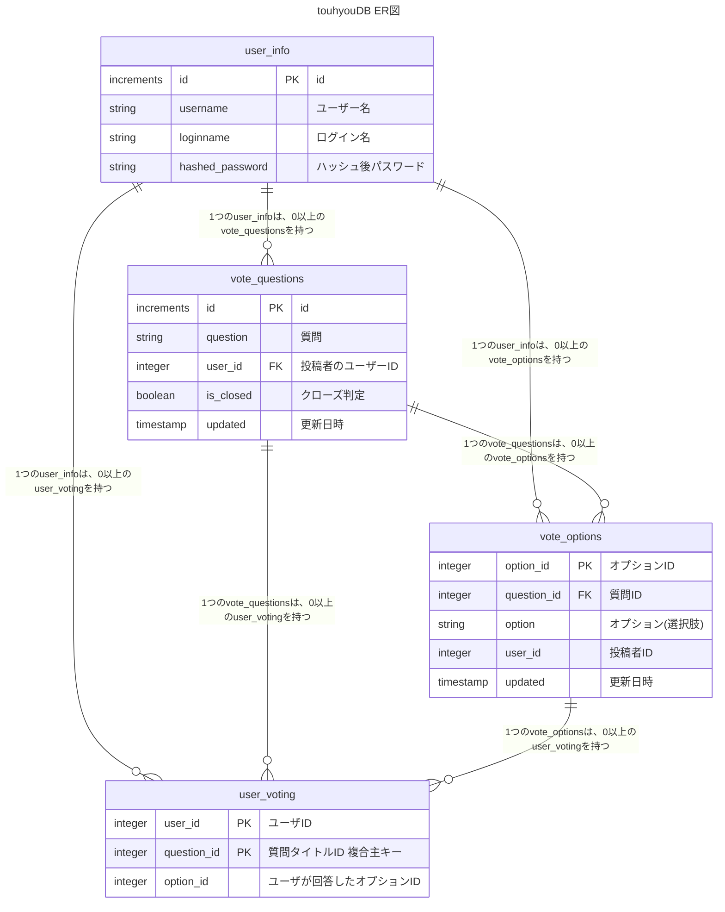

```mermaid
---
title: "touhyouDB ER図"
---
erDiagram

user_info {
increments id PK "id"
string username "ユーザー名"
string loginname "ログイン名"
string hashed_password "ハッシュ後パスワード"
}

vote_questions {
increments id PK "id"
string question "質問"
integer user_id FK "投稿者のユーザーID"
boolean is_closed "クローズ判定"
timestamp updated "更新日時"
}

vote_options {
integer option_id PK "オプションID"
integer question_id FK "質問ID"
string option "オプション(選択肢)"
integer user_id "投稿者ID"
timestamp updated "更新日時"
}

user_voting {
integer user_id PK "ユーザID"
integer question_id PK "質問タイトルID 複合主キー"
integer option_id "ユーザが回答したオプションID"
}


user_info ||--o{ user_voting : "1つのuser_infoは、0以上のuser_votingを持つ"
user_info ||--o{ vote_questions : "1つのuser_infoは、0以上のvote_questionsを持つ"
user_info ||--o{ vote_options : "1つのuser_infoは、0以上のvote_optionsを持つ"
vote_questions ||--o{ vote_options : "1つのvote_questionsは、0以上のvote_optionsを持つ"
vote_questions ||--o{ user_voting : "1つのvote_questionsは、0以上のuser_votingを持つ"
vote_options ||--o{ user_voting : "1つのvote_optionsは、0以上のuser_votingを持つ"
```